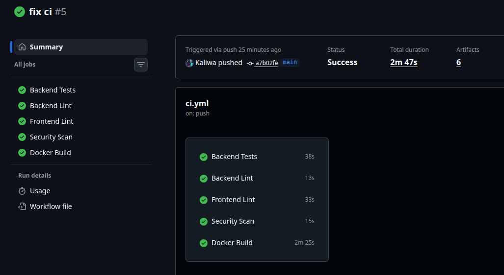
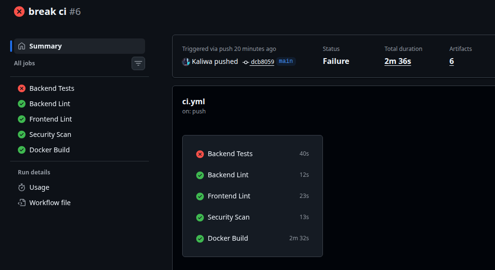
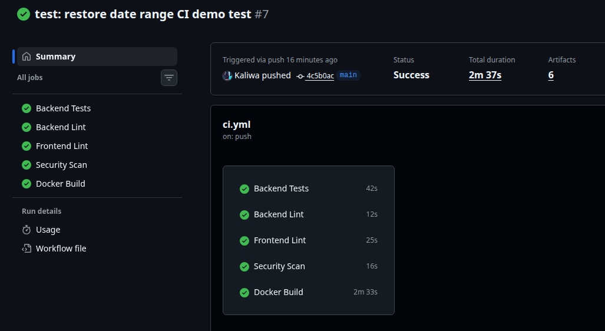
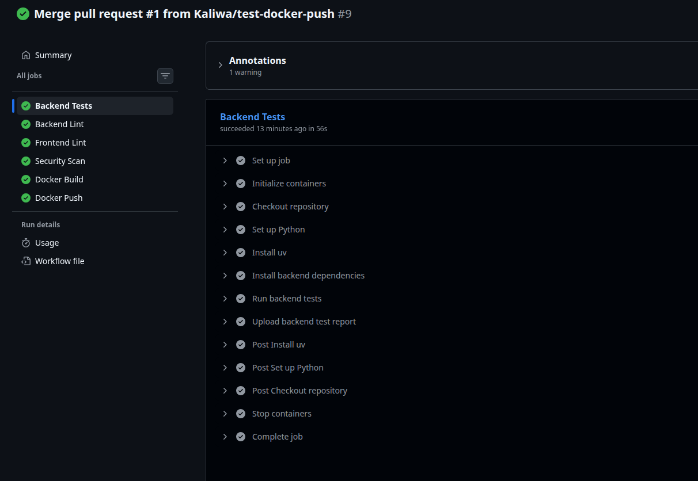
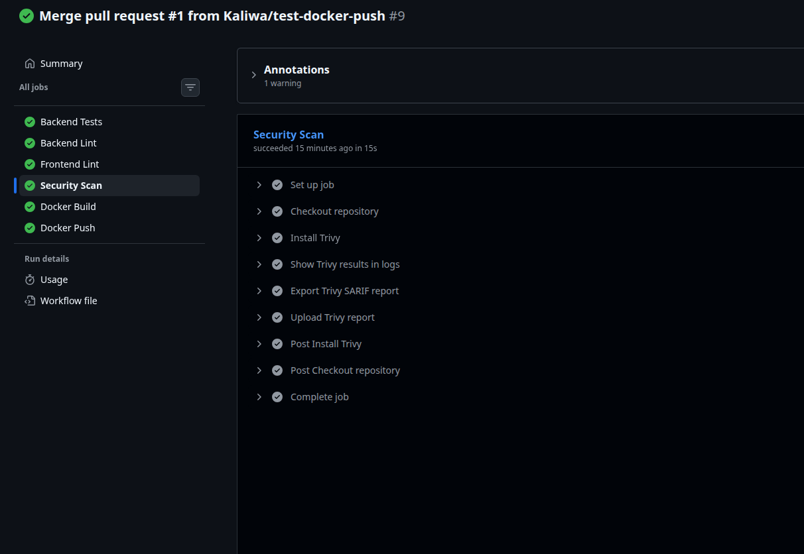
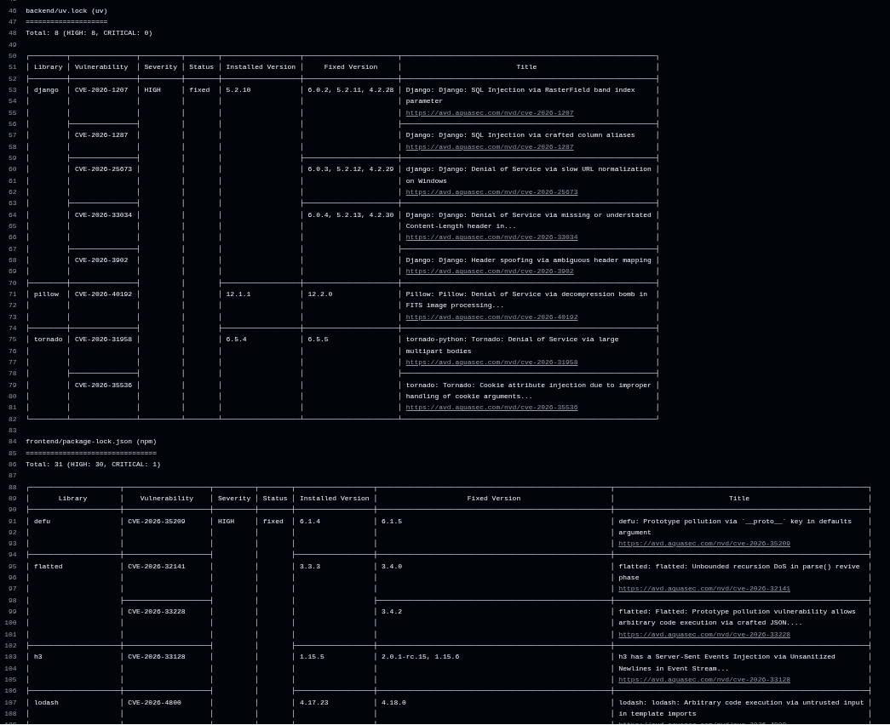
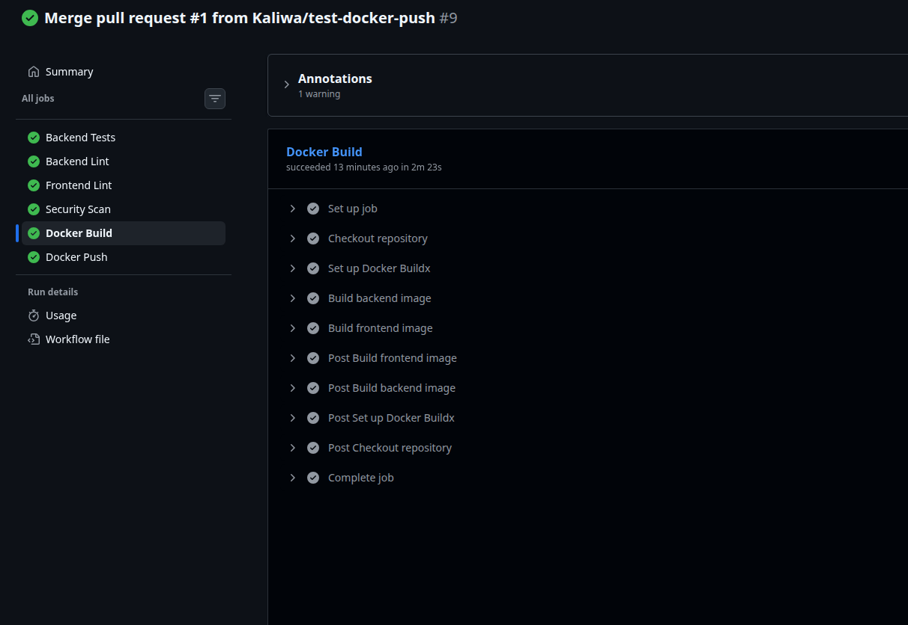
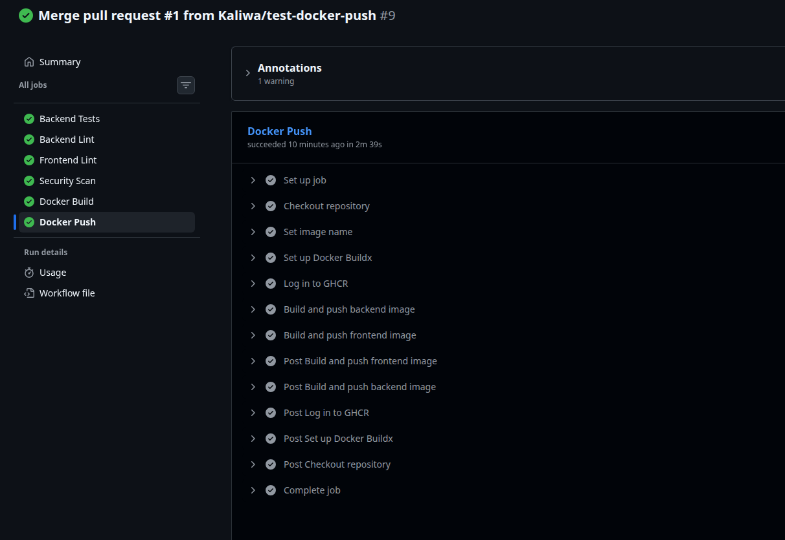
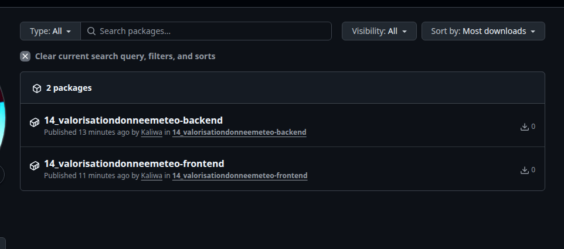

# CI/CD Deliverables

This directory groups the evidence for the CI/CD part of the infrastructure and DevOps project.

## Expected Deliverables

- Functional CI/CD pipeline
- CI badge in the main `README.md`
- Proof that CI fails when a test is broken
- Proof that CI passes again after the fix
- Docker image build
- Docker image push to a registry on `main`
- Test report
- Security scan report
- Trivy report and VEX file

## Repository Elements

- CI workflow: [`.github/workflows/ci.yml`](../../.github/workflows/ci.yml)
- README badge: [`README.md`](../../README.md)
- VEX file: [`security/trivy.openvex.json`](../../security/trivy.openvex.json)
- VEX notes: [`security/README.md`](../../security/README.md)

## Evidence

### 1. Green pipeline

- A screenshot of a successful GitHub Actions run
- The workflow URL if needed by the evaluator
- `screenshots/ci-green.png`

### 2. Broken test detected by CI

- A screenshot of the failed run after intentionally breaking a backend test
- The failing test excerpt from GitHub Actions logs
- `screenshots/ci-red-broken-test.png`

### 3. Fixed test and recovered pipeline

- A screenshot of the successful run after restoring the broken test
- Optionally the commit hashes for the break/fix sequence
- `screenshots/ci-green-after-fix.png`

### 4. Test report

- The `backend-test-report` GitHub Actions artifact
- Or a screenshot showing the backend test job summary and passing tests
- `screenshots/backend-tests-summary.png`

### 5. Security scan report

- The `trivy-report` artifact generated by the CI
- A screenshot of the `Security Scan` job
- A screenshot or text extract of the Trivy findings table
- `screenshots/trivy-findings.png`
- `screenshots/security-scan-job.png`

### 6. Docker build and registry push

- A screenshot of the `Docker Build` job
- A screenshot of the `Docker Push` job on `main`
- A screenshot of the published GHCR packages
- `screenshots/docker-build.png`
- `screenshots/docker-push.png`
- `screenshots/ghcr-packages.png`

## Embedded Evidence

### Green pipeline

### Broken test detected by CI

### Fixed test and recovered pipeline

### Backend test report

### Security scan

### Docker build and registry push

## Notes For Evaluation

- The Trivy scan is kept visible in CI and exported as an artifact.
- The OpenVEX file documents frontend development/build dependencies assessed as not affecting the production deployment.
- Backend runtime vulnerabilities are intentionally left outside the VEX suppression scope and should be handled through dependency updates.
