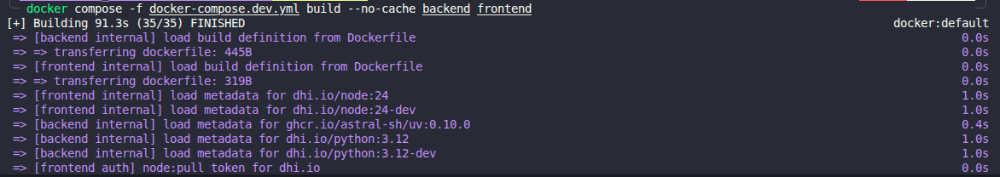
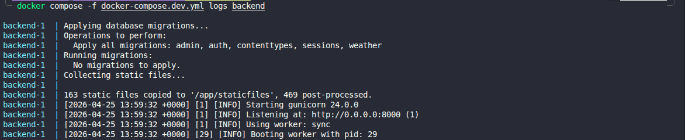

# Docker Hardened Images Deliverables

This directory groups the evidence for the Docker Hardened Images part of the infrastructure and DevOps project.

## Expected Deliverables

- Use Docker Hardened Images for the backend and frontend
- Make the project production-ready with these hardened images
- Prove that the images still build correctly
- Prove that the application still starts correctly with the hardened images

## Repository Elements

- Backend Dockerfile: [`backend/Dockerfile`](../../backend/Dockerfile)
- Frontend Dockerfile: [`frontend/Dockerfile`](../../frontend/Dockerfile)
- Backend runtime entrypoint: [`backend/container_entrypoint.py`](../../backend/container_entrypoint.py)

## What Was Implemented

The backend Docker image was migrated from a standard Python base image to Docker Hardened Images:

- build stage: `dhi.io/python:3.12-dev`
- runtime stage: `dhi.io/python:3.12`

The frontend Docker image was migrated from a standard Node image to Docker Hardened Images:

- build stage: `dhi.io/node:24-dev`
- runtime stage: `dhi.io/node:24`

The backend startup logic was also adapted to remain compatible with a hardened runtime image:

- database migrations are executed at container startup
- static files are collected at container startup
- Gunicorn is then started from the Python virtual environment

This behavior is handled by [`backend/container_entrypoint.py`](../../backend/container_entrypoint.py), which replaces the previous shell-based runtime entrypoint.

## Validation Performed

The following checks were performed successfully:

- `docker compose -f docker-compose.dev.yml build backend frontend`
- `docker compose -f docker-compose.dev.yml build --no-cache backend frontend`
- `docker compose -f docker-compose.dev.yml up -d`
- backend logs confirm:
  - migrations run successfully
  - static files are collected
  - Gunicorn starts correctly

## Evidence

### 1. Hardened image build

- A screenshot of the successful Docker build using the DHI-based Dockerfiles
- `screenshots/build-hardened-images.png`

### 2. Backend runtime validation

- A screenshot of the backend logs showing:
  - `Applying database migrations...`
  - `Collecting static files...`
  - `Starting gunicorn`
- `screenshots/logs-back-hardened-images.png`

## Embedded Evidence

### Hardened image build

### Backend runtime validation

## Notes For Evaluation

- The hardened image migration was validated both at build time and at runtime.
- The backend is still able to run migrations, collect static assets, and serve the application after the DHI migration.
- The frontend image still builds correctly using DHI-based Node images.
