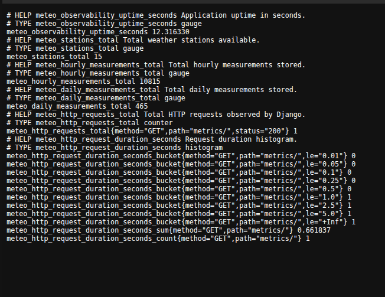
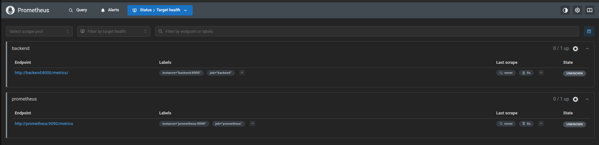
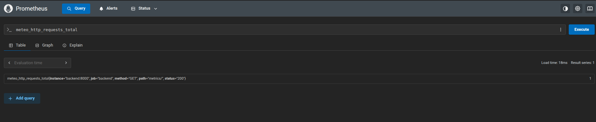
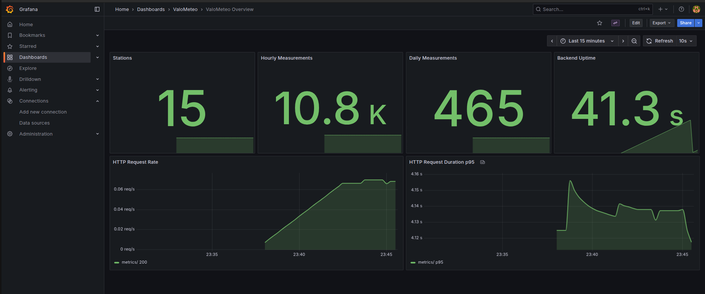

# Observability Deliverables

This directory groups the evidence for the Prometheus and Grafana part of the infrastructure and DevOps project.

## Expected Deliverables

- A backend `/metrics/` endpoint exposing Prometheus-compatible metrics
- A working Prometheus instance scraping the application
- A working Grafana instance connected to Prometheus
- A Grafana dashboard with relevant visualizations

## Repository Elements

- Docker Compose stack: [`docker-compose.dev.yml`](../../docker-compose.dev.yml)
- Nginx proxy: [`nginx/nginx.conf`](../../nginx/nginx.conf)
- Metrics endpoint wiring: [`backend/config/urls.py`](../../backend/config/urls.py)
- Metrics instrumentation: [`backend/weather/observability.py`](../../backend/weather/observability.py)
- Metrics middleware: [`backend/weather/middleware.py`](../../backend/weather/middleware.py)
- Metrics integration test: [`backend/weather/tests/integration/test_metrics_endpoint.py`](../../backend/weather/tests/integration/test_metrics_endpoint.py)
- Prometheus config: [`observability/prometheus/prometheus.yml`](../../observability/prometheus/prometheus.yml)
- Grafana datasource provisioning: [`observability/grafana/provisioning/datasources/prometheus.yml`](../../observability/grafana/provisioning/datasources/prometheus.yml)
- Grafana dashboard provisioning: [`observability/grafana/provisioning/dashboards/dashboards.yml`](../../observability/grafana/provisioning/dashboards/dashboards.yml)
- Grafana dashboard JSON: [`observability/grafana/dashboards/valometeo-overview.json`](../../observability/grafana/dashboards/valometeo-overview.json)

## What Was Implemented

The backend now exposes a Prometheus-compatible endpoint on `/metrics/`.

The exported metrics include:

- application uptime
- total weather stations
- total hourly measurements
- total daily measurements
- total HTTP requests
- HTTP request duration histogram

Prometheus is configured to scrape the backend on `backend:8000/metrics/`.

Grafana is provisioned automatically with:

- a Prometheus datasource
- a dashboard named `ValoMeteo Overview`

## Access Points

- Application metrics endpoint: `http://localhost/metrics/`
- Prometheus UI: `http://localhost:9090`
- Grafana UI: `http://localhost:3001`
- Grafana default credentials: `admin` / `admin`

## Evidence

### 1. Metrics endpoint

- A screenshot of `http://localhost/metrics/`
- A visible extract containing custom `meteo_*` metrics
- `screenshots/metrics-endpoint.png`

### 2. Prometheus target health

- A screenshot of `http://localhost:9090/targets`
- The backend target visible as `UP`
- `screenshots/prometheus-targets.png`

### 3. Prometheus query example

- A screenshot of a query in Prometheus
- For example `meteo_http_requests_total` or `meteo_stations_total`
- `screenshots/prometheus-query.png`

### 4. Grafana dashboard

- A screenshot of the `ValoMeteo Overview` dashboard
- Visible panels populated with real values
- `screenshots/grafana-dashboard.png`

## Embedded Evidence

### Metrics endpoint

### Prometheus target health

### Prometheus query example

### Grafana dashboard

## Notes For Evaluation

- The metrics endpoint is exposed by the Django backend and proxied through Nginx.
- Prometheus scrapes the backend directly on the internal Docker network.
- Grafana is provisioned from the repository, so the datasource and dashboard are reproducible from code.
